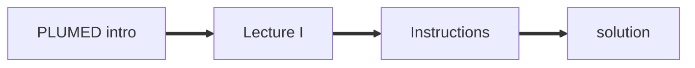

How to prepare a new lesson for PLUMED-TUTORIALS
---------------------------------------------------

### Writing the NAVIGATION.md file

The NAVIGATION.md file is the first file that the user will see when they open your lesson.  This file should provide a flow chart that indicates the order in which the resources you have 
provided in your lesson should be accessed.  You can write these files using [mermaid flowcharts](https://mermaid-js.github.io/mermaid/#/flowchart) which can be emdedded directly into 
[github markdown files](https://docs.github.com/en/get-started/writing-on-github/working-with-advanced-formatting/creating-diagrams).  The following snippet 
shows an example flow chart for a lesson that contains a single video, a markdown file and a python notebook.  In this exercise you are also strongly encouraging them to complete masterclass
21/001 before starting your masterclass.

````

```` 

When the PLUMED-TUTORIALS website is built the nodes in the flowchart thus serve as links to the various pages that are built from the resources you provide.  The NAVIGATION.md file is parsed and
the name of the file or object to embed that is provided in the first set of inverted commas after each click command is replaced by a suitable hyperlink.  (the text in the second set of inverted commas 
on these lines will appear in a tooltip)

### Writing the EMBED.yml file

If there are HTML objects (e.g. YouTube videos, GeoGebra apps) that you would like to embed into your lesson pages, if you would like students to complete some earlier masterclass before trying yours or if you 
want users to connsult an external link you should list them in a yml file called EMBED.yml that will look as follows:

```yml
video1: 
  title: <insert title to use on page that embeds your resource here> 
  location: <insert embed link here>
ref1: 
  location: <insert unique ID of earlier masterclass here e.g. 21/001>
  type: internal
ref2:
  location: <insert link to exeternal website>
  type: external
``` 

Notice that keys in this file are used when constructing the flowchart in the NAVIGATION.md file in place of the location of the file that should be included.

### Writing your markdown files

As explained in the instructions above, the instructions for your lessons must be written in files called `<name>.md` that are
written in [markdown](https://docs.github.com/en/get-started/writing-on-github/getting-started-with-writing-and-formatting-on-github/basic-writing-and-formatting-syntax). The 
website we have linked above gives a good introduction to markdown.  It is worth noting, however, that Markdown also allows you to:

* [Display mathematical expressions](https://docs.github.com/en/get-started/writing-on-github/working-with-advanced-formatting/writing-mathematical-expressions)
* [Include blocks of code](https://docs.github.com/en/get-started/writing-on-github/working-with-advanced-formatting/creating-and-highlighting-code-blocks) with syntax highlighting

There are, in fact, many [advanced features](https://docs.github.com/en/get-started/writing-on-github/working-with-advanced-formatting) in the markdown syntax that you can use.
Furthermore, working markdown is particularly straightforward if you edit your markdown files directly on [GitHub](http://github.com).

We have also extended the markdown syntax so that you can include PLUMED input files in your tutorials using the following syntax:

````
```plumed
d1: DISTANCE ATOMS=1,2
PRINT ARG=d1 FILE=colvar
```
````

When blocks that contain PLUMED input like the one above are encountered in a `README.md` file the scripts that build the website will test that PLUMED can parse the input.  When
these inputs are displayed various badges are displayed to indicate that PLUMED can/cannot parse the input.  Furthermore, a suitably highlighted version of the input that contains 
links and tooltips with information from the PLUMED manual is included in the final website.

We have found it useful to include incomplete inputs in tutorials.  You can include incomplete inputs as shown below:

````
```plumed
#SOLUTIONFILE=work/plumed_input.dat
d1: DISTANCE __FILL__
PRINT ARG=__FILL__ FILE-colvar
```
````

To prevent broken badges from appearing by these incomplete inputs you must include a complete version of the input in your repository. Within the `README.md` file you provide the location of the complete
input in your zip archive by using the `#SOLUTIONFILE` instruction as shown above.  This `#SOLUTIONFILE` comment will NOT appear in the version of the input file that is rendered on 
the PLUMED-TUTORIALS website.

### On cheating 

It is tempting to argue that providing incomplete inputs in the README.md file is pointless if the solutions are available in the repository. When things are organised this way students will 
"cheat" and go directly to the solutions without engaging with the exercise.  This argument is not particularly charitable to students. First of all, it is worth noting that students get no direct reward from 
completing the exercises on this website. It is thus unlikely that the sorts of students who "cheat" are bothering with these lessons.

If you are still woried that this defeats the object though, think about it from the student's point of view. When a student takes on one of these lessons they have to make sense of a lot of things; namely,
your README.md file, the list of resources you provide, everything else in your repository and the whole PLUMED manual. If, in wading through this mountain of data, students find the solutions
and work out that they are the solutions they are doing pretty well!
